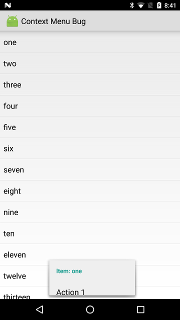
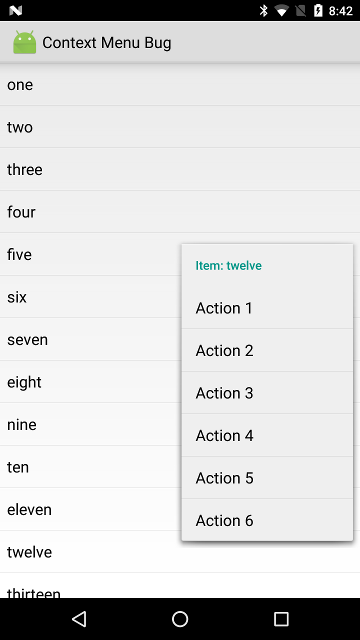

# Context Menu Bug

App to demonstrate that the context menu of a ListView is displayed in the wrong location when using a Holo theme on Android N.

Opening the context menu of an item at the top of the screen shows the menu at the bottom of the screen. 


Opening the context menu of an item towards the bottom of the screen shows the mnu at the correct location.



Making the context menu style set `android:overlapAnchor` to `true` fixes the issue. 

```xml
<style name="AppTheme" parent="@android:style/Theme.Holo.Light">
    <item name="android:contextPopupMenuStyle">@style/MyContextPopupMenuStyle</item>
</style>

<style name="MyContextPopupMenuStyle" parent="@android:style/Widget.Holo.Light.PopupMenu">
    <!-- Setting overlapAnchor to true fixes the issue -->
    <item name="android:overlapAnchor">true</item>
</style>
```

Bug in the AOSP issue tracker: [#221643 ListView context menu displayed in wrong location (Android N)](https://code.google.com/p/android/issues/detail?id=221643)
